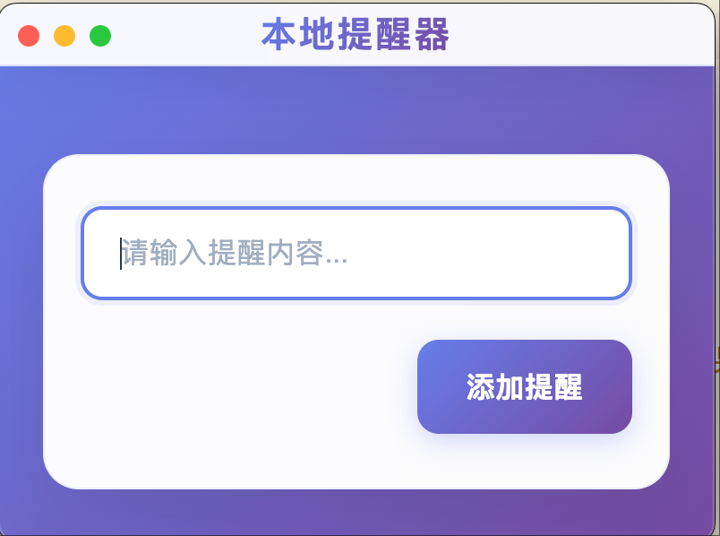

# 🚀 本地提醒器 (Local Reminder)

一个基于 **Electron** 的现代化本地提醒应用，提供简洁美观的界面和强大的提醒功能。极简风格，通过接口预留无限强大的扩展能力。



---

## ✨ 功能特性

- 🎨 **现代化界面设计** - 采用渐变色彩和流畅动画效果
- ⌨️ **快捷操作** - 支持回车键快速添加提醒
- 🌐 **RESTful API** - 提供标准化的HTTP接口
- 📱 **响应式设计** - 适配不同屏幕尺寸
- 🔧 **模块化架构** - 前后端分离，易于扩展和维护
- 🚀 **跨平台支持** - 支持 macOS、Windows 和 Linux
- 💾 **通过自定义接口实现数据持久化和系统通知以及任何想要的功能

## 🚀 快速开始

### 环境要求

- **Node.js** 14.0 或更高版本
- **Python** 3.7 或更高版本
- **npm** 或 **yarn** 包管理器

### 安装步骤

1. **安装前端依赖**
   ```bash
   npm install
   ```

2. **安装Python依赖**
   ```bash
   pip install pync
   ```

3. **启动后端服务器**
   ```bash
   python server.py
   ```

4. **启动Electron应用**
   ```bash
   npm start
   ```

### 开发模式

```bash
# 启动开发模式
npm run dev
```

## 📖 使用指南

### 基本使用

1. **启动应用** - 运行 `npm start` 启动Electron应用
2. **输入提醒** - 在输入框中输入提醒内容
3. **添加提醒** - 点击"添加提醒"按钮或按回车键
4. **查看通知** - 系统会弹出原生通知提醒

### API接口

#### 添加提醒
```http
POST http://localhost:3333/api/reminders
Content-Type: application/json

{
  "text": "你的提醒内容",
  "timestamp": "2024-01-01T12:00:00"
}
```

## 🛠️ 技术栈

### 前端技术
- **Electron** - 跨平台桌面应用框架
- **HTML5** - 页面结构和语义化标签
- **CSS3** - 现代化样式和动画效果
- **JavaScript** - 交互逻辑和API调用

### 后端技术
- **Python** - 服务器端逻辑
- **HTTP Server** - 内置HTTP服务器
- **pync** - macOS系统通知库
- **JSON** - 数据交换格式

### 开发工具
- **npm** - 包管理和脚本运行
- **Git** - 版本控制

## 📁 项目结构

```
local-remider/
├── 📄 index.js              # Electron 主进程文件
├── 📄 index.html            # 主页面HTML文件
├── 📄 styles.css            # 样式文件
├── 📄 renderer.js           # 渲染进程脚本
├── 📄 server.py             # Python后端服务器
├── 📄 package.json          # 项目配置和依赖
├── 📄 package-lock.json     # 依赖锁定文件
├── 📄 reminders.log         # 提醒日志文件
└── 📄 README.md             # 项目说明文档
```

## 🔧 配置说明

### 服务器配置

在 `server.py` 中可以修改以下配置：

```python
PORT = 3333  # 服务器端口
```

### 应用配置

在 `package.json` 中可以修改应用信息：

```json
{
  "name": "local-remider",
  "version": "1.0.0",
  "description": "本地提醒器应用"
}
```
